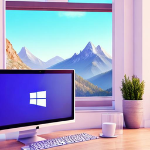
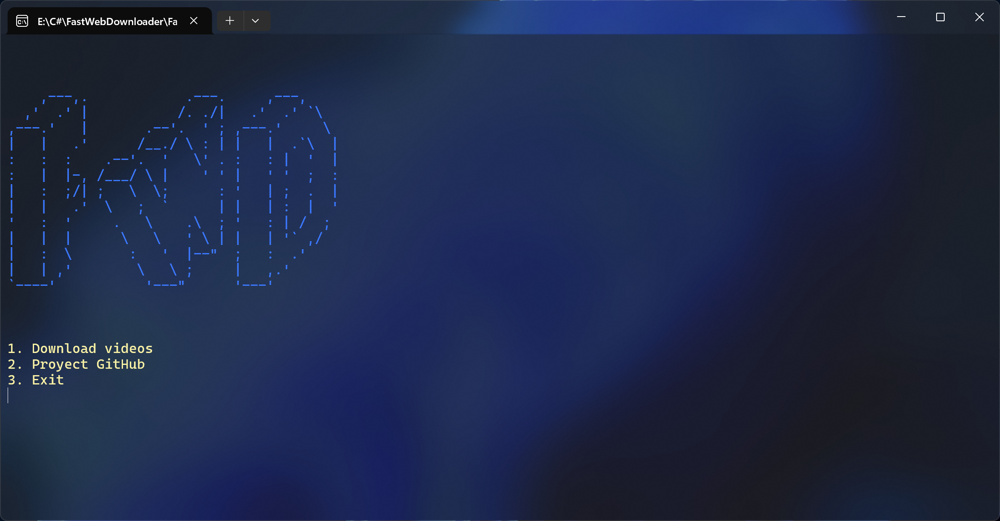
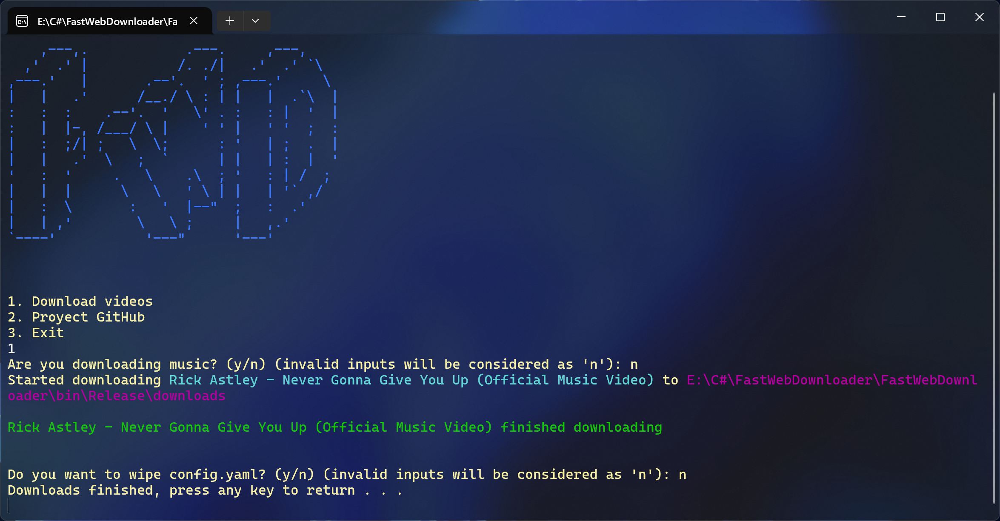

# FastWebDownloader

An easy way to bulk download videos

## Features

- Easily download videos from the web
- Portable configuration file

## Screenshots

## Installation

Extract the zip and run directly!
No instalation needed.

## Usage

1. Launch FWD to create "config.yaml" file
2. Copy YouTube URLs and paste them on "config.yaml", add 1 youtube link per line
3. Select if you want them to be downloaded as audio or video
4. Wait for the downloads to finish

## Contributing

Contributions are always welcomed! To contribute open a new issue and fork the proyect.

## Reposting
Please <u>DO NOT.</u> repost the .exe file directly, redirecting to the proyect's GitHub page is allowed.
